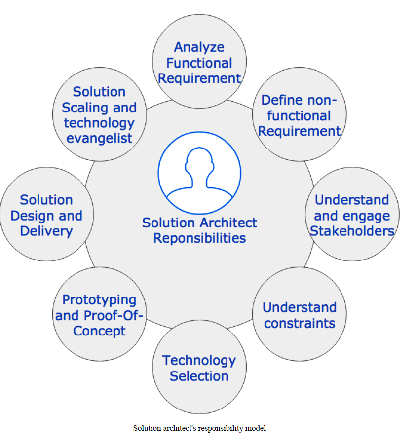
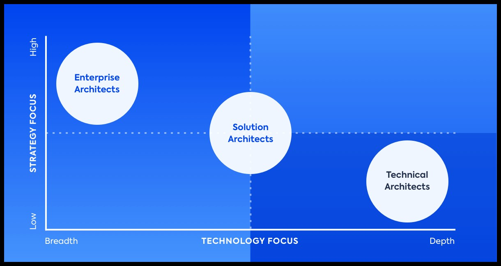

## Responsibilities of a Solution Architect

Solution Architecture translates technical business needs into practical IT solutions while establishing rules and instructions for proper implementation and delivery.  
It also considers all external factors that could have an impact on the development process.  
This way, digital projects are less likely to fail and there is a consensus between EA teams and development teams.   
SA can be seen as a support system that provides structure and reduces the scope of complexity when developing and rolling out new systems and applications.

# Solution architect vs Enterprise Architect vs Technical Architect

Nicely summarized here

### System Design Examples

Many systems design questions are intentionally left very vague and are literally given in the form of "Design Facebook". 

The ABC of System Design are

***A*** Ask good questions   
It's your job to ask clarifying questions to better understand the system that you have to build.
Ask how the much data the system should handle so as to design for scale

***B*** Dont use Buzzwords  
In our fast-paced technology world, every day there are new emerging technologies introduced to us via blog-posts, articles etc. 
It is common to feel like an impostor because you don’t know everything about all the available technologies.  
The best way to overcome this to start by changing the way you think about what big-data is: it’s not about knowledge, it’s about usefulness. 
Similarly, in a system design, dont go for the latest buzzword, you might have heard of, but rather use something you have used and are comfortable with.

***C*** Clear and Organised thinking  
Before jumping into the minor details of the problem, make sure you define the 50000 feet view of the problem. 
Make sure you understand who are the Actors in the system, make sure you have defined the high level APIs, and make sure you have the right communication between systems. 
Then and only then should you go deeper into the details.

For a good System Design you need to first define the following before drawing any boxes

1. Features:      Minimum features you must have: Functional Requirements
2. APIs:          The required APIs, who is going to call them, how they are going to call them
3. Availability:  Decide how HA you want our system to be, with regard to Consistency And Scalability
4. Scalability:   Make sure your system that works for 1000 users, does also work for a million users
5. Durability:    This directly comes from the database choice that you make for your design
6. Latency Performance:  You need to define the latency performance by maybe adding cache for front-end requests 
7. Class Diagram:  Now you can draw your class diagrams, if required
8. Security:        Security is a very important aspect, you might not be able to cover all aspects, but make sure it can be added to your design 
9. Cost Effectiveness: Make sure the design is cost-effective. Based on the required features it comes down to your storage and how you scale it. 

Here are some examples of how you can design the following systems, based on my understanding only:

* [Design a Tiny URL](tinyurl.md)
* [Design Whatsapp](whatsapp.md)
* [Design Twitter](twitter.md)
* [Design Google Maps](google-maps.md)
* [Design Google Drive](google-drive.md)
* [Design Google Docs](google-docs.md)
* [Design Uber](uber.md)
* [Design Netflix](netflix.md)
* [Design Ticket Booking with Virtual Waiting Rooms](virtual-waiting-room.md)
* [Design Payment System](https://newsletter.pragmaticengineer.com/p/designing-a-payment-system?s=r)
* [Design Hotel Booking System](hotel-booking.md)
* [Design Stock Exchange](stock-exchange.md)
* [Design Zoom](https://www.codekarle.com/system-design/Zoom-system-design.html)
* [Atomic Counter](atomic-counter.md)
* [Git Internals](https://github.blog/2022-08-29-gits-database-internals-i-packed-object-store/)
* [Design Blogging System](blogging-system.md)
* [Design Realtime Leaderboard](leaderboard.md)
* [Deploy a WordPress Website](https://github.com/acantril/learn-cantrill-io-labs/tree/master/aws-elastic-wordpress-evolution)
* [Use Cognito to validate user-permissions on resources](cognito-roles.md)
