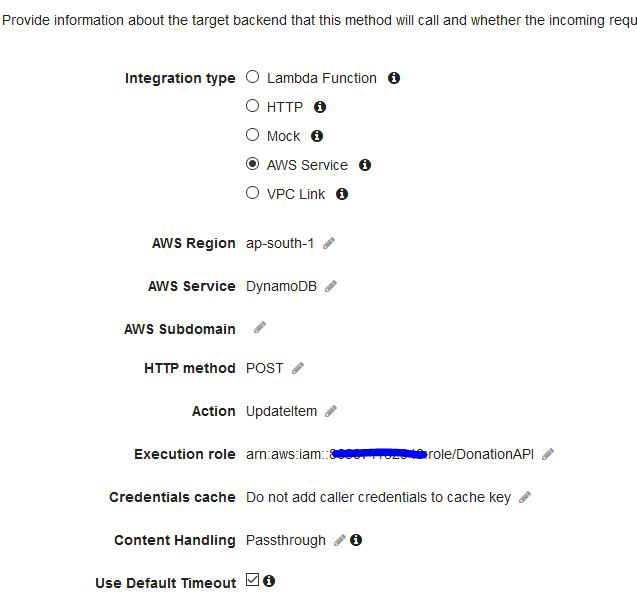
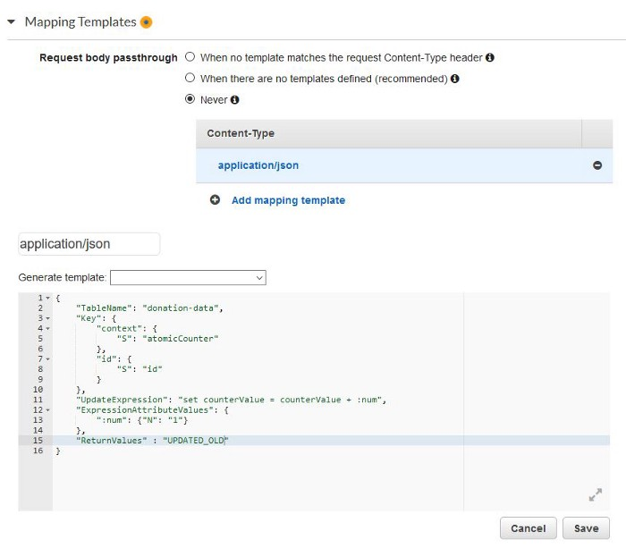

# Simple Atomic Counter

Our system designs often need a central counter.  
We have several simple use-cases like the member id for a registration application, or the amount collected on a sales application, or available seats in a movie theater.

We have to make sure the concurrent updates do not clash, and the no data is lost in the process.   
This problem increases further when our application scales larger on the cloud — with millions of concurrent users.

Let's see an implementation based on API Gateway — Dynamo DB integration. It has a very good response time and minimal cost.


## with DynamoDB and API Gateway

### DynamoDB

DynamoDB is the wonderful serverless NoSQL database provided by AWS. It scales seamlessly to huge volumes and throughput — maintaining extremely fast operations with latency in single digit milliseconds.

Going by the One App — One Table philosophy, create a new Item in the table. You can choose the “primaryKey” field as per your data design.

```
{
   primaryKey: "atomicCounter",
   counterValue: 0
}
```

So we have a counter that starts with 0. Now, we to configure it to increment atomically and return the number. 

DynamoDB API provides a method to do it. In order to invoke it, we have to configure the API Gateway

### API Gateway
The API Gateway is a versatile service to configure and export API’s to the external world. We can use it to invoke Lambda functions, or directly invoke specific AWS Services.

We can configure the API integration to invoke the DynamoDB.



Next we provide an integration mapping for the request. We do it here — at the bottom of the Request Integration page.




```text
UpdateItem
{
    "TableName": "donation-data",
    "Key": {
        "context": {
            "S": "atomicCounter"
        },
        "id": {
            "S": "id"
        }
    },
    "UpdateExpression": "set counterValue = counterValue + :num",
    "ExpressionAttributeValues": {
        ":num": {"N": "1"}
    },
    "ReturnValues" : "UPDATED_OLD"
}
```

#### Response Integration
Similarly, we have to map the output on the response. Click on the Response Integration link and add this mapping in there


```text
#set($value = $input.json('Attributes.counterValue.N'))
#set($l = $value.length())
#set($l = $l - 1)
$value.substring(1,$l)
```


### Deploy
We are done with configuring the API. Now click on Deploy API, select a stage and it is ready to test.


## with REDIS

The counter pattern is the most obvious thing you can do with Redis atomic increment operations. 
The idea is simply send an INCR command to Redis every time an operation occurs. For instance in a web application we may want to know how many page views this user did every day of the year.

To do so the web application may simply increment a key every time the user performs a page view, creating the key name concatenating the User ID and a string representing the current date.

```
redis> SET mykey "10"
"OK"
redis> INCR mykey
(integer) 11
redis> GET mykey
"11"
redis> 

```


## More DynamoDB conditional Update Examples

* The following example performs an UpdateItem operation. It tries to reduce the Price of a product by 75—but the condition expression prevents the update if the current Price is less than or equal to 500.

```text
aws dynamodb update-item \
    --table-name ProductCatalog \
    --key '{"Id": {"N": "456"}}' \
    --update-expression "SET Price = Price - :discount" \
    --condition-expression "Price > :limit" \
    --expression-attribute-values file://values.json
```

The arguments for --expression-attribute-values are stored in the values.json file.

```
{
    ":discount": { "N": "75"},
    ":limit": {"N": "500"}
}
```

* The following example uses attribute_not_exists to delete a product only if it does not have a Price attribute.

```
aws dynamodb delete-item \
    --table-name ProductCatalog \
    --key '{"Id": {"N": "456"}}' \
    --condition-expression "attribute_not_exists(Price)"
```

* DynamoDB also provides an attribute_exists function. The following example deletes a product only if it has received poor reviews.

```
aws dynamodb delete-item \
    --table-name ProductCatalog \
    --key '{"Id": {"N": "456"}}' \
    --condition-expression "attribute_exists(ProductReviews.OneStar)"
```

* The following example uses attribute_type to delete a product only if it has a Color attribute of type String Set.

```
aws dynamodb delete-item \
    --table-name ProductCatalog \
    --key '{"Id": {"N": "456"}}' \
    --condition-expression "attribute_type(Color, :v_sub)" \
    --expression-attribute-values '{":v_sub":{"S":"SS"}}'
```

* The following example uses begins_with to delete a product only if the FrontView element of the Pictures map starts with a specific value.

```
aws dynamodb delete-item \
    --table-name ProductCatalog \
    --key '{"Id": {"N": "456"}}' \
    --condition-expression "begins_with(Pictures.FrontView, :v_sub)" \
    --expression-attribute-values '{ ":v_sub":{"S":"http://"} }`
```


