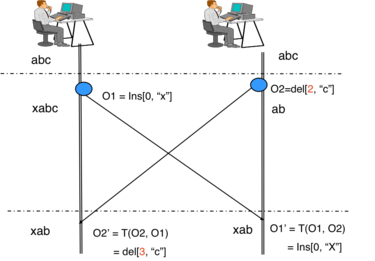

# Design google docs

Google Docs is an online word processor, which allows a simple multi-user document editing, formatting, and storage system.  
The functionality can be broken into the following major components.
1. Organize files(documents) into to folders.
2. Online Shared Editing of these documents, ie. multiple users can update a single document simultaneously.
3. Permissions can be assigned to these documents, owner, read-only etc.

## Functional Requirements
1. Allow a user to create a new document
2. Allow this document to be saved in a logical folder structure
3. Allow this document to be shared with different users 
4. Allow the second user to edit the document collaboratively

## Non-functional Requirements

1. Minimum latency
2. the platform should be scaled for 5 million users
3. the platform should be scaled for 10,000 daily active writers
4. Durable data, Strong consistency

Before, we get into the system design lets understand some logical components

## Collaborative Editing - Concurrent Editing

There are two types of algorithms that are used for collaborative editing.
1. Conflict-free Replicated Data Types (CRDTs)
2. Operational Transformation (OT)

[Operational Transformation](https://en.wikipedia.org/wiki/Operational_transformation) is an algorithm for automatic conflict resolution 

The basic idea of OT can be illustrated by using a simple text editing scenario as follows. Given a text document with a string "abc" replicated at two collaborating sites; and two concurrent operations:
1. O1 = Insert[0, "x"] (to insert character "x" at position "0")  
2. O2 = Delete[2, "c"] (to delete the character "c" at position "2")

generated by two users at collaborating sites 1 and 2, respectively. 

Suppose the two operations are executed in the order of O1 and O2 (at site 1).   
After executing O1, the document becomes "xabc". 

To execute O2 after O1, O2 must be transformed against O1 to become: O2' = Delete[3, "c"], whose positional parameter is incremented by one due to the insertion of one character "x" by O1.   
Executing O2' on "xabc" deletes the correct character "c" and the document becomes "xab". 

However, if O2 is executed without transformation, it incorrectly deletes character "b" rather than "c". 

The basic idea of OT is to transform (or adjust) the parameters of an editing operation according to the effects of previously executed concurrent operations so that the transformed operation can achieve the correct effect and maintain document consistency.

## Access Control
When you invite collaborators to Google docs, and we can keep a list of collaborators with relevant permissions such as read-only, owner, and so on.  
We can then use **RBAC (Role-based Access Control)**.

RBAC (role-based access control) controls network access based on individual user’s responsibilities. Employees using RBAC have access to only the information they need to accomplish their jobs, and they can’t access information that doesn't apply to them.  

In the role-based access control data model, access can be limited to certain actions such as reading, creating, or editing files. Access can be restricted to particular actions, such as reading, producing, or changing files, based on various variables, including authorization, responsibility etc.   

## Storage System

For such a system, we can use simple storage service like S3, where we have concepts like directories, files and owners.

### High-Level Design

We need both Service and Client implementation here.

On the server side, we can use the following components
1. S3 as cloud storage. The edits on the client should be periodically colalted and saved as a flat file on the server. 
2. Websockets like in [WhatsApp Design](whatsapp.md) to communicate the edits between users
3. The backend can use a service like Redis to store the last edits on the document for OT transformations
4. API Gateway and a NoSQL Database for storing the RBAC between documents and users

On the client side, we need to implement OT transformations hence the viewer/editor should use websockets to communicate with the backend

