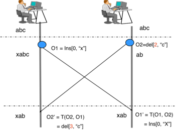
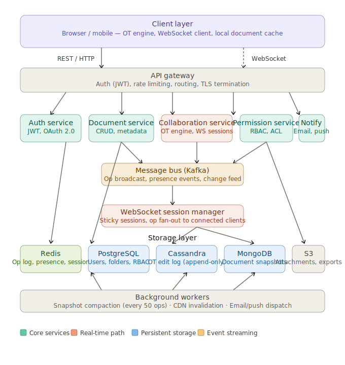

# Design google docs

Google Docs is an online word processor, which allows a simple multi-user document editing, formatting, and storage system.  
The functionality can be broken into the following major components.
1. Organize files(documents) into to folders.
2. Online Shared Editing of these documents, ie. multiple users can update a single document simultaneously.
3. Permissions can be assigned to these documents, owner, read-only etc.

## Functional Requirements
1. Allow a user to create a new document
2. Allow this document to be saved in a logical folder structure
3. Allow this document to be shared with different users 
4. Allow the second user to edit the document collaboratively

## Non-functional Requirements

1. Minimum latency
2. the platform should be scaled for 5 million users
3. the platform should be scaled for 10,000 daily active writers
4. Durable data, Strong consistency


Before, we get into the system design lets understand some logical components

## Collaborative Editing - Concurrent Editing

There are two types of algorithms that are used for collaborative editing.
1. Conflict-free Replicated Data Types (CRDTs)
2. Operational Transformation (OT)

[Operational Transformation](https://en.wikipedia.org/wiki/Operational_transformation) is an algorithm for automatic conflict resolution 



The basic idea of OT can be illustrated by using a simple text editing scenario as follows. Given a text document with a string "abc" replicated at two collaborating sites; and two concurrent operations:
1. O1 = Insert[0, "x"] (to insert character "x" at position "0")  
2. O2 = Delete[2, "c"] (to delete the character "c" at position "2")

generated by two users at collaborating sites 1 and 2, respectively. 

Suppose the two operations are executed in the order of O1 and O2 (at site 1).   
After executing O1, the document becomes "xabc". 

To execute O2 after O1, O2 must be transformed against O1 to become: O2' = Delete[3, "c"], whose positional parameter is incremented by one due to the insertion of one character "x" by O1.   
Executing O2' on "xabc" deletes the correct character "c" and the document becomes "xab". 

However, if O2 is executed without transformation, it incorrectly deletes character "b" rather than "c". 

The basic idea of OT is to transform (or adjust) the parameters of an editing operation according to the effects of previously executed concurrent operations so that the transformed operation can achieve the correct effect and maintain document consistency.

## Access Control
When you invite collaborators to Google docs, and we can keep a list of collaborators with relevant permissions such as read-only, owner, and so on.  
We can then use **RBAC (Role-based Access Control)**.

RBAC (role-based access control) controls network access based on individual user’s responsibilities. Employees using RBAC have access to only the information they need to accomplish their jobs, and they can’t access information that doesn't apply to them.  

In the role-based access control data model, access can be limited to certain actions such as reading, creating, or editing files. Access can be restricted to particular actions, such as reading, producing, or changing files, based on various variables, including authorization, responsibility etc.   

## Storage System

For such a system, we can use simple storage service like S3, where we have concepts like directories, files and owners.

However, s3 while being great for cold storage is not ideal for a live collaborative editor  
We need a NoSQL DB (like Cassandra or DynamoDB) to store the Edit Log (the history of OT operations).

Periodically (e.g., every 50 operations), we collapse the edit log and save a "Snapshot" of the document to S3 or a Document DB (like MongoDB). When a user opens a doc, they load the last snapshot + any pending operations in the log.


### High-Level Design

We need both Service and Client implementation here.

On the server side, we can use the following components
1. S3 as cloud storage. The edits on the client should be periodically colalted and saved as a flat file on the server. 
2. Websockets like in [WhatsApp Design](whatsapp.md) to communicate the edits between users
3. The backend can use a service like Redis to store the last edits on the document for OT transformations
4. API Gateway and a NoSQL Database for storing the RBAC between documents and users

On the client side, we need to implement OT transformations hence the viewer/editor should use websockets to communicate with the backend



### API Design
REST endpoints (stateless, handled by the API gateway):

| Method | Path | Description |
|---|---|---|
| POST  | /documents | Create a new document|
| GET  |  /documents/:id | Fetch document metadata + latest snapshot|
| DELETE | /documents/:id | Soft-delete a document|
| GET | /folders/:id/documents | List documents in a folder|
| POST | /documents/:id/permissions | Share with a user (grant role)|
| DELETE | /documents/:id/permissions/:userId| Revoke access |


### WebSocket protocol (handled by the collaboration service):
```code
Client → Server:  { type: "op",       docId, op: { type, pos, char }, revision }
Client → Server:  { type: "cursor",   docId, position }
Server → Client:  { type: "op",       op: <transformed_op>, revision }
Server → Client:  { type: "presence", userId, cursor, color }
Server → Client:  { type: "ack",      revision }
```
The revision field is the server-side operation counter. Every client tracks the last acknowledged revision and uses it to perform OT transforms before applying incoming ops.

### Data Models

**Document (PostgreSQL):**
```sql
documents(id UUID PK, owner_id UUID FK, folder_id UUID FK,
          title TEXT, created_at TIMESTAMPTZ, updated_at TIMESTAMPTZ,
          snapshot_revision INT, is_deleted BOOL)
```

**OT edit log (Cassandra — partition by doc_id, cluster by revision):**
```code
edit_log(doc_id UUID, revision INT, user_id UUID,
         op_type TEXT,  -- "insert" | "delete"
         position INT, character TEXT,
         timestamp TIMESTAMPTZ,
         PRIMARY KEY (doc_id, revision))
```
Cassandra is ideal here because it's append-only writes at high throughput, and you query by doc_id + revision_range — a perfect partition key pattern.

**Snapshot (MongoDB):**
```json
{
  "doc_id": "uuid",
  "revision": 1250,
  "content": "full document text",
  "created_at": "ISO-8601"
}
```

**Permissions (PostgreSQL):**
```sql
permissions(doc_id UUID, user_id UUID, role ENUM('owner','editor','commenter','viewer'),
            granted_at TIMESTAMPTZ,
            PRIMARY KEY (doc_id, user_id))
```


### Scalability Design
**To hit 5M users / 10K concurrent writers:**
1. **Horizontal scaling of stateless services.** The auth, document, and permission services are fully stateless behind the API gateway — scale them with auto-scaling groups behind a load balancer. Each pod reads from read replicas; writes go to the primary.
2. **WebSocket stickiness.** WebSocket connections are stateful by nature. You route each connection to a dedicated collaboration service pod using consistent hashing on doc_id. All pods subscribe to the Kafka topic for their assigned docs, so an op written by one client is published to Kafka and fanned out to all other pods serving that document's other connected clients.
3. **Redis for hot state.** The last ~50 operations per active document are cached in Redis. When a new client connects mid-session, they fetch the latest snapshot from MongoDB, then replay only the Redis-cached ops rather than replaying thousands of Cassandra rows.
4. **Read scaling.** The document metadata store (PostgreSQL) uses a primary + read replica topology. Most reads (opening a doc, listing folders) go to read replicas. Snapshot reads hit MongoDB, which scales horizontally with sharding by doc_id.
4. **Snapshot compaction.** A background worker watches Cassandra. Every 50 operations, it collapses the edit log into a new snapshot in MongoDB and updates snapshot_revision in PostgreSQL. This bounds the cold-start replay time to at most 50 ops.

### Fault Tolerance & Edge Cases
1. **Client disconnect mid-edit.** The client buffers any unacknowledged ops locally. On reconnect, it re-sends them with the last known revision. The server re-applies OT from that revision and returns the transformed ops.
2. **OT conflict ceiling.** OT only commutes correctly for simple insert/delete. For richer content (tables, images, embedded objects), you need CRDTs (like Yjs or Automerge) or a server-authoritative model where every op is serialized through a single leader for that document.  
The document design here uses a single collaboration service pod per document (via consistent hashing), making the server the authority — this avoids the hardest distributed OT edge cases.  
3. **Partition tolerance.** If the collaboration pod for a document crashes, the consistent-hash router reassigns the doc to another pod. Clients reconnect automatically (WebSocket reconnect logic), re-fetch the latest snapshot + pending ops from Redis/Cassandra, and resume. No writes are lost because ops are written to Cassandra before the ack is sent to the client.
4. **Presence expiry.** Cursor presence is stored in Redis with a TTL (e.g. 10s). The client sends a heartbeat every 5s. If the TTL expires (client disconnected without a clean close), the server broadcasts a presence:leave event to other clients.

### Caching & CDN Strategy
- Static assets (the editor JS bundle, fonts, icons) are served via a CDN (CloudFront / Fastly) with long-lived cache headers. Document content itself is never cached at the CDN layer since it's user-specific and changes frequently.
- For the API layer, you cache two things in Redis: the latest snapshot reference ```(doc_id → {snapshot_id, revision})``` and the permission lookup ```(user_id + doc_id → role)```. The permission cache is invalided on every ```POST /permissions``` write. This removes the two most common DB reads — snapshot lookup on open, and ACL check on every op — from the critical path entirely.