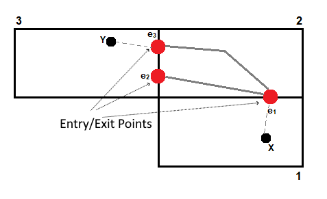

# How to design Google Maps

Google Maps offers satellite imagery, aerial photography, street maps, 360° interactive panoramic views of streets, real-time traffic conditions, and route planning for traveling by foot, car, bike, air and public

### Functional and Non-functional Requirements

Functional Requirements
1. Show Points on Interest (POI) on a map
2. Map can be zoomed in and out to show area
3. Identify Roads and Routes
4. Distance ETA b/w 2 points
5. Show user's current location on the map

Non-functional Requirements
1. The system should be highly available
2. Good accuracy
3. Minimum latency
4. Pluggable model, so that traffic data, closed routes, blockage, bus info etc can be added on the fly


### Capacity Estimation and Constraints

The system is read heavy. There would be a large number of requests compared to updates.
We can safely assume a 1M:1 ratio between reads and writes

### Collection of Road Data, Routes

1. Road data is non-existent, Google uses Local highway authorities (road sensors), car, and taxi fleets and also Crowd-sourced, anonymized traffic data from people using Google maps apps on certain smartphones, including Android
2. Not easy to quantify the route planning, cause the ETA estimation depends on local factors like weather, traffic, road conditions etc

### Geohash

A Geohash is a unique identifier of a specific region on the Earth. The basic idea is that the Earth is divided into regions of user-defined size and each region is assigned a unique id, which is called its Geohash. For a given location on earth, the Geohash algorithm converts its latitude and longitude into a string.

A geohash actually identifies a rectangular cell: at each level, each extra character identifies one of 32 sub-cells.   


The cell sizes of geohashes of different lengths are as follows; note that the cell width reduces moving away from the equator (to 0 at the poles):


| Geohash length |	Cell width x Cell height |
|---|---|
|1	| ≤ 5,000km	×	5,000km |
|2	| ≤ 1,250km	×	625km |
|3	| ≤ 156km	×	156km |
|4	| ≤ 39.1km	×	19.5km |
|5	| ≤ 4.89km	×	4.89km |
|6	| ≤ 1.22km	×	0.61km |
|7	| ≤ 153m	×	153m |
|8	| ≤ 38.2m	×	19.1m |
|9	| ≤ 4.77m	×	4.77m |
|10| 	≤ 1.19m	×	0.596m |
|11| 	≤ 149mm	×	149mm | 
|12| 	≤ 37.2mm × 18.6mm |

Nearby locations generally have similar prefixes, though not always: there are edge-cases straddling large-cell boundaries;   
in France, La Roche-Chalais (u000) is just 30km from Pomerol (ezzz). 

A reliable prefix search for proximate locations will also search prefixes of a cell’s 8 neighbours.   
(e.g. a database query for results within 30-odd kilometres of Pomerol would be  
```
SELECT * FROM MyTable WHERE LEFT(Geohash, 4) IN ('ezzz', 'gbpb, 'u000', 'spbp', 'spbn', 'ezzy', 'ezzw', 'ezzx', 'gbp8'). 
```

Advantages of Geohash
1. Very easy to find the parent cell, by simply truncating the geohash
2. Very quick calculation to find the adjoining 8 cells

### Data for Roads, POI etc

The easiest way to visualise a road network is as a graph, where each junction will be a node and each road will be an edge. 

Using Geohashes above, we can easily shard the graph edges, the lat long of the POIs and store this information in a NoSQL Database.  
The Primary key, will always be a Geohash against a Satellite image stored on a CDN distributed HDFS/S3/Cloud Store   
Each Geohash resolution will map to a different Satellite image, with POIs drawn on the fly based on resolution.   
The POIs themselves will be stored with Geohash (representing minimum)    


### Distance Calculation

Each edge can have multiple weights like distance, time, traffic etc. which we can use to find the shortest/quickest path. 
From this graph visualisation we can safely say there will be multiple paths between various points, so we will run any of the graph algorithms like
1. Djikstra's Algorithm
2. Bellman Ford Algorithm
3. Floyd Walsh algorithm  

to find shortest paths between various points within the segment.   

Also to avoid recalculating these paths again and again and to serve the real-time needs, we will cache this information and we will call this shortest path a calculated edge or calculated path.

If the user wishes to go from one region to another? We'll utilize what's known as entrance and exit points (denoted by red dots). There are specific places of entry and exit between two regions or leaves. We compute and save the distance between these two points. We may then utilize this distance to determine the most effective path.



Assume we need to compute the distance between points X and Y. We can accomplish this by utilizing the cache to determine the distance between entry/exit points e1 and e3, and then calculating the distance between X and Y and their corresponding entry/exit points.

### ETA Calculation

The ETA is difficult to determine since it is influenced by a variety of factors. We must consider traffic, weather conditions, crowded places, and other factors when calculating the ETA between two sites on a map. One way is to collect real-time data from various users and then compute ETA based on it. Consider computing ETA between two points. We leverage user data to compute standard deviations, analytics, and so on to generate an approximate ETA between the provided places.


