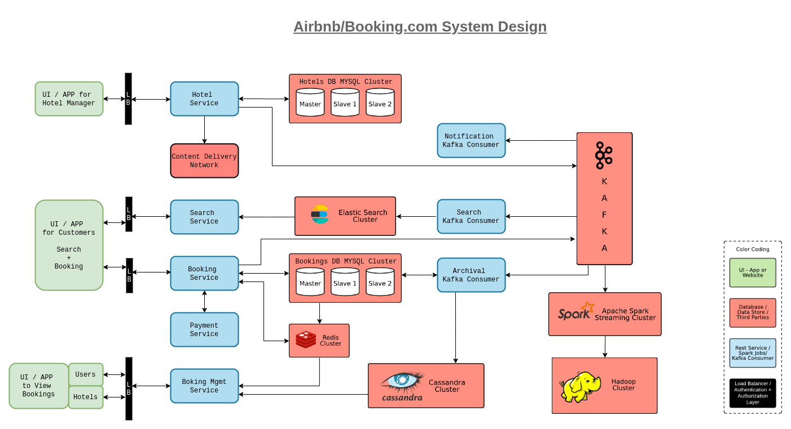

# Hotel Booking System Design

Design a Hotel Booking System like Airbnb OYO etc 

### Functional and Non-functional Requirements

Functional Requirements
1. Hotels
   1. Onboarding System to add hotels
   2. Update existing hotel information
   3. View Bookings, revenues etc
2. Users
   1. Search hotels in a region
   2. Book Hotels
   3. View bookings
3. Analytics
4. Payments System (out of scope)

Non-functional Requirements
1. Low latency
2. High Availability
3. High Consistency

### Scale
 
Lets say, we want to provide for 500K, 10M rooms and  roughly 1000 Rooms/ Hotel

### UI and flow for Hotel Management people to use

This could be a UI or a Webapp for on-boarding or modification **BUT NOT** analytics.
We can use a SQL database (sharded cluster or in a Master Slave(s) W/R configuration) to store the hotel information as there is no scaling or cross joins problem

All we need is a load balancer (or a set of load balancers behind an DNS Route 53) routing requests to our hotels service.

The hotel information, like images etc will be distributed by a CDN service to be highly available.

For Efficient Searching by the users, we could leverage an ElasticSearch Cluster.   
ElasticSearch is a distributed, open search engine for all types of data including textual, numerical, geospatial, structured and unstructured.  
We are using ElasticSearch here instead of Geohash shared database, 'cause we would need text based search based on user's requirements along with Geolocation and the results ranked based on inputs. (fuzzy search)   
A fuzzy search is a process that locates Web pages that are likely to be relevant to a search argument even when the argument does not exactly correspond to the desired information.

Each Modification that is happening to the Hotels Database will be sent to a Kafka cluster.
This information can have multiple subscribers, one of them could be a ElasticSearch Cluster updater.

The users, via a Search Service behind another set of load balancers, can query our ElasticSearch Database to view hotels of interest in the geographical area.

The users, once they want to do a booking, can use the booking service which handles the payments, offers etc.  
This information is again sent to a SQL cluster along with the kafka service for notification, analytics, record keeping etc.  
Again, the Elasticsearch Database would also be a subscriber to this service to update the available rooms etc.

One more feature we can add, is from SQL cluster, we can send the data to a NoSQL distributed database like Cassandra, for archival query purposes.

Here, Kafka is working as a Service bus, to send messages to and from various services and databases.

We also could have a Spark Cluster consuming events from the Kafka service and storing the data into a Haoop datawarehouse for Analytics and Report Generation via Hive etc.