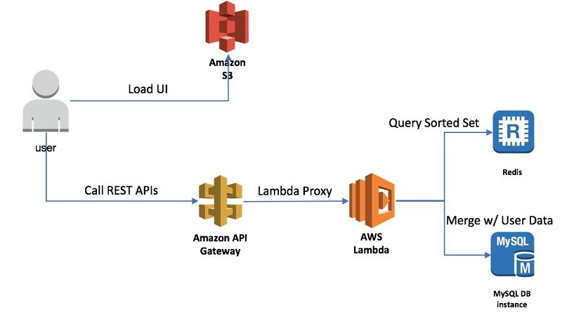

# Build a Realtime leaderboard


With leaderboards, a user can check his performance, his rankings, his standing with respect to other players or his friends

### Use a Relational database for leaderboard?

In a game, a simple leaderboard would need two particular details: user-id or UUID and user’s score. This can be represented in a relational table like this:

| Field   | Type    |
|---------|---------|
| user_id | varchar |
| score   | int |


Entries into the table would be like :
```
INSERT INTO leaderboard (uuid, score) VALUES (‘User1’, 99);
```

Updates would be like 
```
UPDATE leaderboard set score=score+1 where uuid=‘User1’;
```

As the number of users increases(say to a million), we face scaling issues due to following reasons:
* This simple query can take tens of seconds when the number of users is in millions in a large table
* Calculation of rank for a specific user requires the query to compute all users leaderboard positions
* Database for leaderboard requires continuous adding of users, removing users, updating user’s scores, finding rankings, etc. Relational database perform suboptimally for such use case
* A relational database cannot take a load of excessive read query if such queries are fired at a high frequency(We can cache the result of a query or can scale through slave databases, but for real-time games, this solution might return stale data and gives poor user experience)

Thus **a relational database is not a good choice for real-time leaderboard**

# Redis to Rescue

Redis is an in-memory structure store. It provides speed in a high load environment that is impossible to achieve through relational databases. Moreover, it’s unique data structures can be utilized to perform amazing tasks, and **we will be using it’s sorted set** to build a highly efficient and scalable leaderboard.

### Sorted set data structure of Redis

Redis Sorted Sets are, similarly to Redis Sets, non repeating collections of Strings. The difference is that **every member of a Sorted Set is associated with score, that is used in order to take the sorted set ordered**, from the smallest to the greatest score. While members are unique, scores may be repeated.

In layman terms, sorted sets is a data structure which store unique strings and each such strings has an associated score(which is sorted).  
For example, let’s say we have three users, User1, User2, User3, and they have current points of 70,90 and 80 respectively. Then in the sorted set, these users are unique strings and their points (70,90 and 80) are scores which are stored in sorted order(smallest to greatest 70->80->90)

In the sorted set, we can efficiently add or remove elements from the middle. Moreover, we can also quickly calculate the rank of a specific member. These features make Sorted set perfect data structure of leaderboard which requires predictable performance even under high load and speedy rank calculation.

Following is a comparison of List, HashSet, and Sortedset data structure:

|   | List | HashMap | SortedSet |
|---|---|---|---|
| Iteration | O(n) | O(n) | O(n) |
| Search    | O(n) | O(1) | O(n) |
| Add | O(n) | O(1) | O(log n) |
| Remove | O(n) | O(1) | O(log n) |
| Enumeration in Sorted Order | O(n Log n) | O(n Log n) | O(n) |
| Allow Duplicates | YES | NO | NO |

### Redis Sorted Set Operations

Redis supports many operations that can be done with sorted-sets. Since we require only a few to create a real-time leaderboard so i will only cover the required ones. In Redis nomenclature sorted sets are denoted by ZSET and all operations have prefix Z (Like ZADD)

#### ZADD : Add one/more member for a given score to ZSET/initialize a ZSET with one/more member

```
127.0.0.1:6379> ZADD score 70 User1 90 User2 80 User3
(integer) 3
```

#### ZRANGEBYSCORE : Fetches items in the ZSET based on range of scores

```
127.0.0.1:6379> ZRANGEBYSCORE score 0 100
1) User1
2) User3
3) User2
```

#### ZRANGE : Fetches all the items in the ZSET from their position in sorted order
```text
127.0.0.1:6379> ZRANGE score 0 100 WITHSCORES
1) User1
2) 70
3) User3
4) 80
5) User2
6) 90
```

### ZSCORE : Returns the score of the member in the ZSET
```text
127.0.0.1:6379> ZSCORE score User1
70
```

### ZCOUNT : Returns the number of members with scores between the provided minimum and maximum in ZSET
```text
127.0.0.1:6379> ZCOUNT score -inf +inf
3
```

### ZRANK : Returns the position of the given member based on his score in ZSET
```text
127.0.0.1:6379> ZRANK score User1
0
127.0.0.1:6379> ZRANK score User2
2
127.0.0.1:6379> ZRANK score User3
1
```

### ZINCRBY : Increments the score of a member in the ZSET
```text
127.0.0.1:6379> ZINCRBY score 10 User1 
80
```

#### ZREM : Removes an item from the ZSET, if exists
```text
127.0.0.1:6379> ZREM score User1 
(integer) 1
```


# Overall design



We obviously, at the minimum need an API Gateway in front of a lambda, which interacts with the Redis as well as a persistent database to store the scores as depicted above


