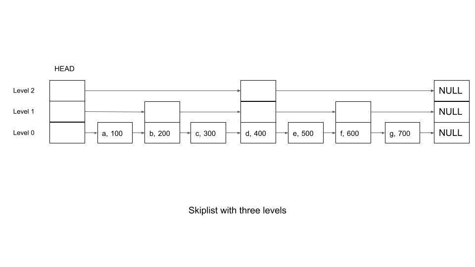

## Why is Redis so fast?

When evaluating database performance, Redis consistently stands out as an anomaly. It routinely handles hundreds of thousands of concurrent operations per second with sub-millisecond latencies, all while running predominantly on a single execution thread.

To traditional software engineers accustomed to multi-threaded architecture and horizontal scaling, this sounds like a paradox. How can a single thread outperform highly concurrent systems?

The answer does not lie in a single silver bullet, but in a carefully engineered trifecta:
1.  In-Memory Storage, 
2. a Lock-Free Single-Threaded Event Loop, and 
3. Linux I/O Multiplexing (epoll). 

Lets take a deep dive into the underlying systems architecture that makes Redis an industry standard for high-performance data delivery.

### 1. The Foundation: Pure In-Memory Operations
Traditional relational databases (like PostgreSQL or MySQL) are designed around the constraints of non-volatile storage. They must constantly move data back and forth between system memory and Solid State Drives (SSDs) or Hard Disk Drives (HDDs).

Even with modern NVMe technology, physical drive interaction introduces a massive latency penalty:
1. NVMe SSD Latency: Measured in microseconds ($\mu s$).
2. RAM Latency: Measured in nanoseconds ($ns$), roughly 100x to 1,000x faster.

```
[Disk Storage (SSD/HDD)]  ---> Microseconds (Slow) ---> CPU
[System Memory (RAM)]    ---> Nanoseconds (Fast)  ---> CPU
```

Redis eliminates the disk bottleneck entirely by storing its primary dataset in system memory. When a command arrives, Redis does not have to look up page allocations on disk, wait for a cache miss to resolve from storage, or deal with heavy database engine overhead like transactional logging blocks.   
It reads and manipulates data structures directly at raw hardware memory speeds.

While Redis does offer persistence options (AOF and RDB) to prevent data loss during power cycles, these processes are decoupled from the main execution thread via background forking (fork()), ensuring that disk I/O never interferes with active client operations.

### 2. The Paradox: Single-Threaded and Lock-Free
In modern systems design, the standard approach to scaling throughput is to add more threads. However, multi-threading introduces steep hidden taxes on CPU performance:
1. **Context Switching Overhead:** When a CPU core switches execution from one thread to another, it must save the current thread's register states, reload the new thread's state, and frequently invalidate its L1/L2 CPU caches. **At extreme scale, the CPU can spend more time managing threads than doing actual work**.
2. **Resource Contention and Locking:** If multiple threads attempt to modify the same key at the same time, you encounter race conditions. To prevent data corruption, multi-threaded databases must implement locking mechanisms like Mutexes, Semaphores, or Read-Write locks. Threads end up wasting cycles waiting in queues for locks to release.

Redis bypasses these synchronization issues by running its core execution engine on a single thread.

Because only one thread has access to the data store, **Redis is entirely lock-free.** It processes every command sequentially, atomically, and deterministically. There is zero time wasted on context switching, and no thread ever blocks waiting for a lock. The CPU core dedicated to Redis runs at maximum cache efficiency, blasting through commands one by one.

### 3. The Enabler: Asynchronous I/O Multiplexing via epoll
Being single-threaded introduces a critical flaw: **if the thread blocks on a slow operation, the entire server freezes**. If a client opens a connection but takes several seconds to send a command over the network, a naive single-threaded server would block while waiting on that specific socket. Every other client would be locked out.

To solve this, Redis relies on **I/O Multiplexing**, which is implemented via the Linux **epoll** system call (or kqueue on macOS/BSD).

Instead of opening a new thread for every client connection, Redis routes all network connections through a single kernel-driven event loop known as the **aeEventLoop**.

#### The Evolution from select/poll to epoll
Early Unix systems used select or poll for I/O multiplexing, but they suffered from an $O(N)$ scaling bottleneck. When data arrived on a socket, the kernel would wake up the server thread, but it wouldn't specify which socket had data. The server had to linearly scan through every single connected socket to find the active one. If you had 100,000 active connections, it had to loop 100,000 times for every single network event.

Linux **epoll** solves this by introducing a callback-driven approach that reduces complexity to $O(1)$:
1. **Registration (epoll_ctl):** When a client connects to Redis, the socket descriptor is added to the kernel's epoll interest list.
2. **Kernel Callbacks:** The Linux kernel monitors the network hardware directly. When network packets arrive for a specific client, the kernel triggers an internal callback and moves that specific socket into a dedicated Ready List (a doubly-linked list).
3. **Instant Execution (epoll_wait)**: The main Redis thread calls epoll_wait(). This call blocks only until a socket is ready. Crucially, it returns **only the active sockets.**

If Redis has 50,000 idle connections and 3 clients suddenly send commands simultaneously, epoll_wait instantly drops exactly those 3 active sockets into the Redis event loop. 

Redis loops exactly three times, executes the commands in memory, writes the responses back, and immediately returns to sleep. 
The 50,000 idle connections consume absolutely zero CPU time.

#### 4. Optimized Low-Level Data Structures
The final piece of the performance puzzle is how Redis manages memory internally. Redis isn't just storing raw strings; it offers complex data types like Hashes, Lists, Sets, and Sorted Sets. To maintain sub-millisecond speeds, Redis dynamically changes the underlying memory layout of these structures based on their size:
* **Ziplists and Listpacks:** If a Hash or List contains only a small number of elements, Redis stores them in a tightly packed, contiguous block of memory called a ziplist (or listpack in newer versions). This minimizes memory fragmentation and maximizes CPU cache hits because the data sits perfectly sequentially in hardware memory.
* **Skiplists:** For Sorted Sets (ZSET), Redis uses a combination of a Hash Table and a Skip List. A skip list allows Redis to perform logarithmic $O(\log N)$ search, insertion, and deletion operations by maintaining multiple layers of forward-pointing links, giving it the performance advantages of a balanced tree but with a simpler, faster implementation layout.

Conclusion: The Synergy of the Redis TrifectaTo understand why Redis scales so efficiently, think of it as a meticulously designed production pipeline:

```
|                       THE REDIS TRIFECTA                  |
|-----------------------------------------------------------|
| 1. epoll (Network)   --> Asynchronously captures ready    |
|                          packets; keeps the thread fed.   |
| 2. Single Thread     --> Processes requests sequentially; |
|                          zero locks, zero context switches|
| 3. In-Memory (RAM)   --> Manipulates data structures at   |
|                          nanosecond hardware speeds.      |
```


## Understanding SortedSet implementation in Redis
In Redis, sorted sets are implemented using a combination of a **hash table** and a **skip list** data structure. The hash table provides fast access to elements based on their value, while the skip list maintains the sorted order of the elements based on their scores. This dual structure allows Redis to efficiently perform operations on sorted sets.

### Understand the Skiplist Concept

While balanced trees like AVL or Red-Black trees also provide O(log n) performance, skiplists are simpler to implement and tune, and their probabilistic nature is well-suited for scenarios like Redis, where constant-time amortized performance is often good enough.  
Skiplist is particularly effective in memory-constrained environments due to its relatively simple structure and predictable performance characteristics. Redis takes advantage of these features to handle billions of sorted set operations efficiently.


Think of a skiplist as multiple linked lists stacked on top of each other:
* **Bottom list**: This is the full sorted list of elements.
* **Upper lists**: Each level "skips" some elements from the level below, helping us jump closer to the target element faster.  
Each element appears in **at least one level**, but some may appear in more levels (randomly decided).



A skiplist node will store:
* Value (key): The data or key you’re storing.
* Score: A number (like in Redis) used for sorting.
* Pointers: References to the next node at the same level and the node below.

A skiplist structure will:
* Keep track of the head node for all levels.
* Allow operations like search, insert, and delete.

To better understand the concept, read here  
https://jothipn.github.io/2023/04/07/redis-sorted-set.html#determining-the-random-level


## Redis Cluster

When your dataset grows so large that it can no longer fit into the RAM of a single physical server, Redis Cluster allows you to scale out horizontally by breaking that massive dataset into smaller chunks (shards) and spreading them across multiple machines.  However, Redis Cluster doesn't just do raw sharding; it implements it in a very specific way using Hash Slots and combines it with High Availability.  

### 1. How Redis Cluster Shards: The 16,384 Hash Slots
Unlike some databases that use "consistent hashing" or shard by ranges (like A–M go to Node 1, N–Z go to Node 2), Redis Cluster uses a concept called Hash Slots.  
* There are **always exactly 16,384 hash slots** in a Redis Cluster.  
* When you set up a cluster, these 16,384 slots are divided up among your master nodes. 

For example, if you have 3 master nodes:
* Node A gets slots 0 to 5460
* Node B gets slots 5461 to 10922
* Node C gets slots 10923 to 16383

### How a key finds its home:
Every time you run a command like *SET user:100 "John"*, Redis figures out which server owns that data using a deterministic formula:$$\text{Slot} = \text{CRC16}(\text{"user:100"}) \pmod{16384}$$

Because the formula is deterministic, the key "user:100" will always map to the exact same slot number, and therefore the exact same shard.

### 2. Why use "Slots" instead of direct sharding?
Using fixed slots makes resharding (scaling up or down) incredibly easy and seamless. 

If you run out of space on your 3 nodes and add a Node D, Redis doesn't have to scramble all your data. It simply moves a few thousand slots from Nodes A, B, and C over to Node D. 

While those slots are moving, the rest of the cluster stays fully online and continues serving traffic.  

### 3. The Other Half: High Availability (Failover)
If you only shard your data and Node B dies, you instantly lose 1/3 of your database. To prevent this, a Redis Cluster enforces a Master-Replica model for every shard.  

Each master node gets one or more replica (slave) nodes that copy its data asynchronously.  
* If Node B (Master) crashes, the remaining nodes hold an election via a cluster bus protocol.  
* They automatically promote Node B1 (Replica) to become the new Master.  
* The cluster updates its internal map to say "Node B1 now owns slots 5461 to 10922," and your application keeps running without missing a beat.

### Summary of the Scaling Strategies  
To keep things clear, it helps to look at the different ways Redis scales:

|Strategy |What it's for| How it works|
|---|---|---|
|Sentinel / Basic Replication| High Availability & Read Scalability | One master handles all writes and replicates data to multiple clones. If master dies, Sentinel promotes a replica. Dataset must still fit on one machine.|
| Redis Cluster | Write Scalability & Data Volume Scalability | Data is split across multiple masters using 16,384 hash slots. Each master has its own replicas. Dataset can scale infinitely across machines.|