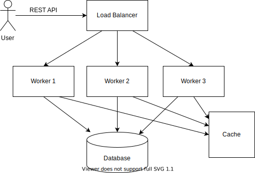

# How to design TinyURL

TinyURL is a URL shortening service which creates shorter aliases for long URLs.
When clicking the short link, the user is redirected to the original URL.

### Functional and Non-functional Requirements

Functional Requirements
1. Generate short URL from the orginal URL
2. Redirect the user to the original URL from the short URL

Non-functional Requirements
1. The system should be highly available
2. The shortened URLs should not be predictable in any manner
3. The redirection should happen in real-time with minimum latency

### Capacity Estimation and Constraints

The system is read heavy. There would be a large number of redirections compared to new URL shortening requests.
We can safely assume a 100:1 ratio between reads and writes

##### Traffic Estimation

Considering Twitter has 300 million users per month, assuming our service becomes as popular, we get ~300M shortening requests per month.
Lets say we want to keep our service for 5 years, we will store 300M * 12 * 5 = ~20 billion requests

We will be serving out 300 million/(30 days * 24 hours * 3600 seconds)  = ~200 shortening requests/sec
Considering the 100:1 read/write ratio, the redirection requests will be ~ 20K requests/sec

##### URL Length

The Shortended URL should be a combination of characters (a-Z) and numbers (0-9), so we have possible 62 characters,
and 62^7 = 3.5 trillion combinations, so a shortened URL length of 7 should suffice our needs.

##### Data Capacity
1. Consider average long URL length 500 bytes
2. short URL size of about 7 bytes for 7 characters
3. created at 10 bytes

Total is 517 bytes.

For 30M shortening requests per month, we have 517 * 300M = ~ 140 GB per month and in 5 years ~= 8 TB

### Database Design

We just need a single table, with ShortenedURL as the key, and full URL and created time as Columns
The best type of database to use would be a NoSQL database store like DynamoDB or Cassandra since we are storing billions of rows with no relationships between the objects.

### Algorithm Design

We can compute a unique hash (e.g. MD5, SHA256, etc.) of the input URL, and then encode it for display
This encoding could be base62 ([A-Z, a-z, 0–9]), remember base64 also includes + and /

If we use the MD5 algorithm as our hash function, it will produce a 128-bit hash value.
After base62 encoding, we’ll get a string with more than 21 characters (since each base62 character encodes six bits of the hash value).
Now we only have space for SEVEN characters per short key. How will we choose our key then?

We could take the first 7 characters of the encoded string, check the database, and insert if the key doesn't already exist.
In case of collision, we could right shift and try again.

However, in case of a multi-node cluster, we could have a race condition, where two different nodes try to write the same key for different URLs.
1. We could use Zookeeper for coordination between the instances, such that the key becomes an ephemeral node, and which-ever instance creates the node gets to write to DB, and the other one regenerates the key and tries again.

3. Generating a random String for each URL, and/or appending Timestamp don't guarantee that the same input URL will give the same shortened URL and hence not being discussed here.

### Zookeeper Leader Election
* A simple way of doing leader election with ZooKeeper is to use the **SEQUENCE|EPHEMERAL** flags when creating znodes that represent "proposals" of clients.  
* The idea is to have a znode, say "/election", such that each znode creates a child znode "/election/{guid}-n_" with both flags SEQUENCE|EPHEMERAL.  
* With the sequence flag, ZooKeeper automatically appends a sequence number that is greater than anyone previously appended to a child of "/election".  
* The process that created the znode with the smallest appended sequence number is the leader.

### Cache

Our service should be able to cache URLs that are frequently accessed, through a solution like Memcached
Because we want to replace a link with a more popular URL, we can use the Least Recently Used (LRU) policy for our cache system.

### Scalability

We will ideally have multiple servers generating the short URLs for us. These can be placed behind a load balancer.
For Database Scalability, we would have NoSQL databases like Cassandra, or DynamoDB which are horizontally scalable.
These databases, use hash-based partitioning, which takes hash of the object being stored and then calculate which partition to use. The hashing function will randomly distribute the data into different partitions, hence there will not be any problem of hot-regions

