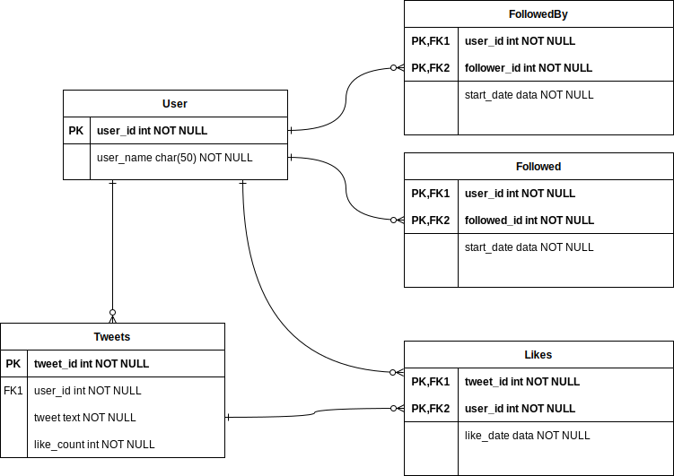

# How to design twitter

Twitter is an microblogging and social networking service on which users post and interact with messages known as "tweets".
Registered users can post, like and retweet tweets. 
The design of Facebook, Instragram can follow the same principles.

### Functional and Non-functional Requirements

Functional Requirements
1. Users should be able to tweet as fast as possible
2. Users can follow other users
3. Users should be able to see the Home timeline, which shows tweets from people they follow (their followees)
4. Users should be able to see their User timeline, which shows the tweets they have done
5. Users should be able to like other tweets
6. Search functionality to be able to search based on keywords

Non-functional Requirements
1. The system should be highly available
2. The system should scale to handle millions of users
3. The tweets should happen in real-time with minimum latency

### Storage of Tweets

The tweets should be stored forever, and the storage medium should allow delete based on tweet-id.

### Communication Protocol

REST based API should be able to handle all the required functionality.

### Database Design

It is obvious that we need a read-heavy system, and the table design should have the following relational structure:

* Users Table: Which stores the info about the users in the system
* Tweets Table: Which stores the tweets done against the user ID
* Followed Table: Which stored the other users this user follows
* FollowedBy Table: This is an auxilary table, which can quickly show which users follow this particular user for display only

* Once a user is registered, the entries for this user is saved in the Users Table.
* Once the user starts following another user, entries in the Followed and Followed tables are made accordingly.
* For each tweet, an entry is made in the Tweets Table, and for each like a corresponding entry is made into the Likes table.

So now to build the User's Personal timeline, a simple Query over the Tweets table in reverse chronological order would suffice. 
However to build the User's Home timeline, we would need to first fetch all the users this user is following, and then fetch tweets from the global tweets table for this user list. This obviously has the drawback of NOT BEING SCALABLE, despite tricks like sharding, caching etc.

A solution to the above problem is, while submitting a tweet, we fanout the processing, such that when a tweet arrives, we can find out which are the **ACTIVE** followers in the system and then for these users, the cache for these users can be updated to store the tweet. The write also happen to database and multiple caches will also be updated only for the active users.

A simple flow of tweet looks like,
* "User A" Tweeted
* Through Load Balancer tweet will flow into back-end servers
* Server node will save tweet in DB/cache
* Server node can push the tweet info into a distributed messaging system like kafka
* The distributed processing system, will fetch all the users that follow "User A" from the database/cache
* The processing system will inject this tweet into in-memory timelines of his followers
* Eventually, all followers of "User A" will see the tweet of User A in their timeline

However, if you consider the case of celebrities, they will have millions of followers. 
Here injecting each tweet into the followers timelines would take a lot of processing and will not good latency wise 
So, we can
* Precomputed home timeline of "User A" with everyone except celebrity tweet(s)
* When User A access his timeline his tweet feed is merged with celebrity tweet at load time.
* For every user have the mapping of celebrities list and mix their tweets at runtime when the request arrives and cache it.

For Search, we can use Lucene based systems like Elastic Search

### Databases uses by Twitter
* **Redis** drives Timeline, Twitter’s most important service. Chaining tweets together in a list produces the Home Timeline. The User Timeline, which consists of tweets the user has tweeted, is just another list
* **Gizzard** is Twitter’s distributed data storage framework built on top of **MySQL (InnoDB)**. InnoDB was chosen because it doesn’t corrupt data. Gizzard is just a datastore. Data is fed in and you get it back out again. To get higher performance on individual nodes a lot of features like binary logs and replication are turned off. Gizzard handles sharding, replicating N copies of the data, and job scheduling.
* **Cassandra** is used for high velocity writes, and lower velocity reads. The advantage is Cassandra can run on cheaper hardware than MySQL, it can expand easier, and they like schemaless design.
* Hadoop is used to process unstructured and large datasets, hundreds of billions of rows.
* Vertica is being used for analytics and large aggregations and joins so they don’t have to write MapReduce jobs.
* Tweeter handles searching for its tweets and #tags using **Earlybird** which is a real-time, reverse index based on Lucene. Earlybird does an inverted full-text indexing operation. It means whenever a tweet is posted it is treated as a document. The tweet will be split into tags, words, and #tags, and then these words are indexed
  
### Further Reading

* [How Twitter Uses Redis To Scale - 105TB RAM, 39MM QPS, 10,000+ Instances](http://highscalability.com/blog/2014/9/8/how-twitter-uses-redis-to-scale-105tb-ram-39mm-qps-10000-ins.html)
* [The Engineering Behind Twitter’s New Search Experience](https://blog.twitter.com/engineering/en_us/a/2011/the-engineering-behind-twitter-s-new-search-experience.html)  
* [Decoding  X's (Twitter) ALGORITHM](https://twitter.com/javilopen/status/1717284652661297319)
