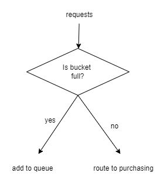
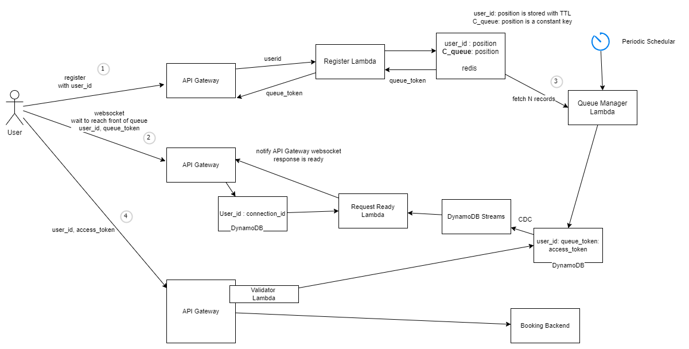

# Ticket Booking System with Virtual Waiting Room

Lets design a system for ticket booking for concerts.  
Assume, we are designing the system to support huge volumes of traffic when Ticket sales go online(say a Taylor Swift concert) and we need to limit the rate at which users can start a session.

### Functional and Non-functional Requirements

Functional Requirements

1. Ticket sales will go online at a specified time. Expect huge load on the system during this time.
2. Serve the users on a first-come-first-serve basis. The user, once logged in is, is placed in a FIFO queue to make purchase

Non-Functional Requirements
1. Low latency
2. High availability
3. Highly scalable

### Leaky-Bucket algorithm

A leaky bucket algorithm is primarily used to control the rate at which traffic enters the network. It enforces a constant transmit rate regardless of the erratic burstiness in the input traffic of a flow.

### Virtual waiting rooms

While we could simply direct the user to purchasing system, we would need to scale up the infrastructure to handle traffic spikes to handle high-demand ticket sales

Instead, we could create a virtual waiting room, which
1. absorbs traffic spikes and pipes it as a constant traffic to the purchasing backend
2. provides a fair way by using a First-in-First-out(FIFO) principle
3. protects the core purchasing service from  outages due to high-load

Consider the scenario of ticket sales going online at 7 AM.  
1. The users would start hitting the service say, at 6:30 AM. Any request before this time could simply return a 503 service error.
2. These users would be given a "visitor token" and kept in a virtual queue. This "visitor token" could be the registration timestamp  (or an auto-incrementing number) , obviously encrypted with userid to prevent tampering
3. Any subsequent request to the backend system, should include this "visitor token". 
4. Once the ticket sales go online, a backend system, would redirect first-N users to the purchasing system
5. These users have a time-limit to make the purchase (say 3 minutes). After which their session gets invalidated and the next set of users are allowed in the system
6. The user would ideally make a purchase before the timeout, and the next user would be allowed in the system

Consider the system design below

1. Once the user logs into the system, gets a queue_token, which denotes his position in the queue 
    * This could be a simple HTTP Request, rate limited by an API gateway
    * For storage, we could use Redis keyvalue as user_id: position (and also position:user for quick retrieval)
    * as previously mentioned, we can add basic protection on top of this position to prevent users gaming the system
    * for generating the position, we could simply use timestamp(possibility of conflicts) or use REDIS inbuilt INCR functions or even REDIS inbuilt queues (LPUSH and RPOP)
    * in any scenerios, such records should be stored with a TTL to utilize redis functionality of auto-garbage collection
    * In redis, we also store the current queue position in a constant key C_queue_position
2. All subsequent requests from the user, needs the have this queue token
    * We can implement this via websockets, such that when the user reaches the top of the queue, he is automatically redirected to the next step
    * to use Websocket with API gateway, we follow the standard pattern where the connection_id is stored in a DynamoDB table, and once the response is ready, a lambda notifies the API g/w that the response is ready
3. Once the booking backend system is live, a lambda can periodically fetch current queue position, fetch N users and  generate an access token for each of these users.
    * These records can be placed in a DynamoDB table so that we can validate the access_token for subsequent requests
    * We could hookup Change Data Capture (CDC) to this dynamodb table and provide the access_token to the users listening onto the websocket
4. With the access_token in hand, the user can finally access the backend system for ticket booking, after going through a lambda validator which validates the access token from the DynamoDB above

### Scalability concerns

* The users obviously do not call the API gateways directly, but via a front-end which can be hosted using a CDN
* While we have rate limited the Backend Booking system, the other API Gateways for UserRegistration and TokenGeneration would come under heavy load. These will need to be rate-limited and we could also swap out the API g/w + lambda combination for ALB + EC2 for heavier load.

Some considerations
* AWS API Gateway has a limit of 10,000 RPS (requests per second), 
* For Regional and Edge APIs, the limit is 600 and 120, respectively. 
* The 10,000 limit also benefits from burst capacity – up to 5,000 additional RPS – in peak demand moments. However, AWS does not take any hard commitments, and developers can’t control or predict how the burst capacity will be allocated.
* ALB, on the other hand, is virtually unlimited. AWS specifies no limits in terms of connections per second or concurrently in the service quotas page. It can easily scale to handle +100,000’s RPS in a second and, in principle, could go beyond millions of RPS as well at these levels
* It is probably a good idea to pre-warm the Load Balancer with the help from the AWS support team, as well as to conduct stress tests and make sure the architecture is well optimized for the load.

### AWS API Gateway (REST vs HTTP)

1. **REST API (10,000 RPS Limit)**  
The REST API type in API Gateway is the older, feature-rich option that includes many built-in capabilities:

#### Why REST APIs Have a Lower RPS?
- More Overhead
    - REST APIs support authentication (IAM, Cognito, Lambda Authorizers), request validation, transformations, logging, and integrations with various AWS services.
    - Each request undergoes multiple processing steps, increasing latency and reducing scalability.
- Built-in Features
    - API Keys & Usage Plans → Rate limiting per client.
    - Stage Variables → Configuration management for different environments.
    - Integration with AWS X-Ray → Adds tracing overhead.
- More Expensive and Heavier Processing
    -   REST APIs use a regional endpoint model, meaning they must handle the entire request lifecycle, including transformations and security checks.

#### Best Use Cases for REST APIs
- Applications requiring fine-grained request processing.
- APIs needing authentication, transformation, logging, and monitoring.
- Serverless applications using AWS Lambda.
- Multi-tenancy support with API Keys & usage plans.

2. **HTTP API (100,000 RPS Limit)**  
AWS introduced HTTP APIs as a lightweight, high-performance alternative to REST APIs.

#### Why HTTP APIs Have a Higher RPS?
- Lower Overhead
    - HTTP APIs strip down many of the advanced REST API features (e.g., request validation, stage variables, API Keys) for better performance.
    - They provide only essential features like JWT-based authentication (Cognito) and direct AWS service integrations.
- Simplified Routing & Execution
    - HTTP APIs are optimized for direct integrations with Lambda, ALB, and other HTTP backends.
    - API Gateway doesn’t need to process as many steps per request.
- Better Pricing & Scaling
    - HTTP APIs are cheaper than REST APIs.
    - They can handle 10x more RPS (100K vs. 10K) due to reduced processing.

#### Best Use Cases for HTTP APIs
- High-performance public APIs.
- Applications that don’t require extensive request transformation or validation.
- Simple microservices and event-driven architectures using Lambda.
- ALB or direct HTTP backend integration.

#### REST API vs. HTTP API Comparison
| Feature | REST API | HTTP API |
|---|---|---|
| RPS Limit| 10,000| 100,000 |
| Latency | Higher | Lower |
| Authentication | IAM, Cognito, Lambda Authorizers	| JWT (Cognito) |
| Request Transformation | ✅ Supported | ❌ Not Supported |
| Rate Limiting |	✅ Usage plans |	❌ No built-in per-user limits |
| Direct ALB Integration |❌ No |	✅ Yes |
| X-Ray Tracing |	✅ Yes |	❌ No |
| Cost |	Higher |	Lower |
