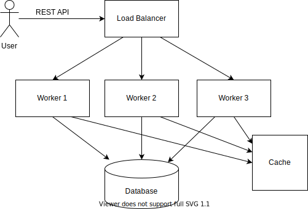

# How to design Whatsapp

Whatsapp is a chat-based application. Once you know the design of Whatsapp application you would design any chat-based application with newer features.

### Functional and Non-functional Requirements

Functional Requirements
1. One to one Chat between Contacts (friends)
2. User doesn't need to be online always, but can receive previous offline messages when connected.   
3. Ability to create Groups with multiple Admins managing group members   
4. Sent + Delivered + Read receipts with Tick marks on the UI
5. Online/ Last Seen for your contacts
6. Image + Document sharing in chat messages
7. Simple User Registration with Mobile Number + SMS code.

Non-functional Requirements
1. The system should be highly available
2. The system should scale to handle millions of users 
3. The chats should happen in real-time with minimum latency
4. The chats should be end-to-end encrypted

### Storage of Messages

We could either store the messages forever on the database, or we could save the messages till they are read and then deleted from the system.
Given the current security scenarios, lets design the system so as to store the data encrypted on the server

### Communication Protocol

We need a bi-directional communication protocol, as the server could also initiate a request, eg when a message for the current user is received by the system.
Here we use ***WebSockets***, but the other available options could be

***WebSocket***: Websocket is a fully bi-directional connection, which means once a userA is connected to the server, both client and server can initiate a request. Websocket also has sticky session, which when used with load balancer helps the initial server only handle the response

***BOSH***: Bidirectional Streams over Synchronous HTTP, which means once a userA sends a request to the server, the server holds on the request till certain time has passed or it has some new data, at which point it will send a response back

***Long Poll HTTP***: Client sends a request to the server, the server can respond I don’t have the data, the client waits for some time and then initiates a new request

***MQTT***: MQTT is a lightweight publish/subscribe messaging protocol designed for M2M (machine to machine) telemetry in low bandwidth environments. The key component in MQTT is the MQTT broker. The main task of MQTT broker is dispatching messages to the MQTT clients (“subscribers”). In other words, the MQTT broker receives messages from publisher and dispatches these messages to the subscribers. While it dispatches messages, the MQTT broker uses the topic to filter the MQTT clients that will receive the message. The topic is a string, and it is possible to combine the topics creating topic levels.

Once a user opens our application, it will check with the backend, whether the current mobile number + device ID pair are previously registered or not. 
Else we prompt the user to authenticate with a SMS code, that will be generated by the server. Once the user authenticates with the provided SMS code, we register the device against the user (#reqt 7)

Now the application will connect to the load balancer, which will choose a backend node, say N2 for this session. 
Now the application will periodically heartbeat with Node N2 and this heartbeat can be saved in a Redis with the last heartbeat timestamp.
The idea being, that when the backend needs to send a message to this user say U1, we can quickly find out which Node (N2 here) is connected to the U1 session.
This way, the Node N2, doesn't need to periodically scan the database for fresh messages for U1

If the Node N2 dies, or application exits or the session is closed for any other reason, the heartbeat timestamp will tell us that the Node assignment is not valid.
Now if a new session is created and say Node N3 is connected to user U1, the cache will be updated with this information, and heartbeat timestamp.

Once Node N3 see that it is making a new entry in the Cache, it can scan the backend database for new messages and send them to the user.
This heartbeat mechanism is also used to find out when the user was last seen (# reqt 5)

Now suppose user U3 wants to send a message to user U1. The app will show U3 all the phone contacts available, and we can find out via a REST API whether the users are registered with our service or not. Once U3 selects U1 to chat with, and say U3 is connected to N4, the message M1, is sent to N4. N4 in turn saves the message to our database, and also looks up the cache to see if U1 is online, and which node it is connected to, N3 here.
N4 then sends the message, and the user info U1 to N3, which is turn sends the message to U1 over the websocket. N3 will also mark the message as received by U1. (#reqt 4)

Consider the case when U3 wants to send a message to U2 who is not online. In this case N3 sees that there is no current session/node for U2, and just stored the message in the database. When user U2 comes online, its connected server and scan the database for the available offline messages and send them to U2. (#reqt 2)

Similarly, the user can create groups, which can be modelled just like above, where instead of the user's U3 node connecting to a single node, sends the incoming message to multiple nodes for the currently active users.

### Security

We want the messages to be end-to-end encrypted, i.e. the messages are not sent as plain text, but encrypted on the device before being sent over the network.  
For this, for a conversation between U1 and U2, the first time a conversation is initiated, we generate an unique encryption key on the server, and provide this encryption key to our app. The application uses this key for encryption for sending messages between U1 and U2 ***only***.
The same encryption key is also provided to the application running with user U2, and only it can decrypt the message.
For each conversation, we use a different encryption key, for better security, and isolation guarantee.

### Database Design

Obviously, we need a NoSQL database to host the messages. I would use Apache Cassandra here, which is a free and open-source, distributed, wide column store, NoSQL database management system designed to handle large amounts of data across many commodity servers, providing high availability with no single point of failure.

Cassandra is wide column store, and, as such, essentially a hybrid between a key-value and a tabular database management system. Its data model is a partitioned row store with tunable consistency.Rows are organized into tables; the first component of a table's primary key is the partition key; within a partition, rows are clustered by the remaining columns of the key. Other columns may be indexed separately from the primary key.

Cassandra has the concept of Primary Keys, Composite Primary Keys, Partition Keys and Clustering Keys

***Primary key*** concept in Cassandra is different from Relational databases. When you lookup data in Cassandra, for best performance, you must provide the Primary Key.

***Partition key*** is responsible for distributing data among nodes. A partition key is the same as the primary key when the primary key consists of a single column.
Partition keys belong to a node. Cassandra is organized into a cluster of nodes, with each node having an equal part of the partition key hashes.

***Composite keys*** are partition keys that consist of multiple columns.

***Clustering keys*** are responsible for sorting data within a partition. Each primary key column after the partition key is considered a clustering key.

Take the following examples
1. K1: primary key has only one partition key and no cluster key.
2. (K1, K2): column K1 is a partition key and column K2 is a cluster key.
3. (K1,K2,K3,...): column K1 is a partition key and columns K2, K3 and so on make cluster key.
4. (K1, (K2, K3,...)): It is same as 3 i.e column K1 is a partition key and columns K2,K3,... make cluster key.
5. ((K1, K2,...), (K3,K4,...)): columns K1, K2 make partition key and columns K3,K4,... make cluster key.

Imagine we have a four node Cassandra cluster. In the example cluster below, Node 1 is responsible for partition key hash values 0-24; Node 2 is responsible for partition key hash values 25-49; and so on.

For our messaging sytem, could have the following tables

| UserInfo       | Stores the user info        |
|:---------------|---|
| UserID         |   The primary key which uniquely identifies the user for our system |
| MobileNumber   |   The current mobile number of the user |
| DeviceID       |   The current device of the user |
| RegisteredOn   |   The date user is first registered on our system |

| UserConnection   | Stores the U1-U2 connection info, as well as U2-U1 connection info using 2 rows    |
|:-----------------|---|
| User1            |   User1 is the primary key |
| User2            |   User2 is the clustering key |
| ConversationID   |   A unique conversation ID |
| EncryptionKey    |   The encryption key which is used to encrypt the messages between U1-U2. This key is itself encrypted with a master key before being stored  |

| GroupConnection | Stores the group connection info, where we can find out which groups a user belongs to, conversely, which users are in the group |
|:-----------------|---|
| GroupID            |   GroupID is the primary key |
| GroupName          |   The name of the group |
| UserID             |   UserID, which is the clustering key |
| ConversationID     |   A unique conversation ID |
| IsAdmin            |   Is this user a group admin, who can add/remove users |
| EncryptionKey      |   The encryption key which is used to encrypt the messages in this group. This key is itself encrypted with a master key before being stored  |

| Conversations    | Stores all the conversations |
|:-----------------|---|
| ConversationID     |   ConversationID is now the primary key |
| Time               |   The timestamp of the message is now the **Clustering** key, and messages are retrieved in sorted order |
| FromUserID          |   The user who sent the message |
| EncryptedMessage   |   The encrypted Message |
| SentTimestamp      |   The message sent timestamp  |

### Capacity Estimation and Constraints

The system is read heavy. There would be a large number of redirections compared to new URL shortening requests.
We can safely assume a 100:1 ratio between reads and writes

##### Traffic Estimation

Considering Twitter has 300 million users per month, assuming our service becomes as popular, we get ~300M shortening requests per month.
Lets say we want to keep our service for 5 years, we will store 300M * 12 * 5 = ~20 billion requests

We will be serving out 300 million/(30 days * 24 hours * 3600 seconds)  = ~200 shortening requests/sec
Considering the 100:1 read/write ratio, the redirection requests will be ~ 20K requests/sec

##### URL Length

The Shortended URL should be a combination of characters (a-Z) and numbers (0-9), so we have possible 62 characters,
and 62^7 = 3.5 trillion combinations, so a shortened URL length of 7 should suffice our needs.

##### Data Capacity
1. Consider average long URL length 500 bytes
2. short URL size of about 7 bytes for 7 characters
3. created at 10 bytes

Total is 517 bytes.

For 30M shortening requests per month, we have 517 * 300M = ~ 140 GB per month and in 5 years ~= 8 TB

### Database Design

We just need a single table, with ShortenedURL as the key, and full URL and created time as Columns
The best type of database to use would be a NoSQL database store like DynamoDB or Cassandra since we are storing billions of rows with no relationships between the objects.

### Algorithm Design

We can compute a unique hash (e.g. MD5, SHA256, etc.) of the input URL, and then encode it for display
This encoding could be base62 ([A-Z, a-z, 0–9]), remember base64 also includes + and /

If we use the MD5 algorithm as our hash function, it will produce a 128-bit hash value.
After base62 encoding, we’ll get a string with more than 21 characters (since each base62 character encodes six bits of the hash value).
Now we only have space for SEVEN characters per short key. How will we choose our key then?

We could take the first 7 characters of the encoded string, check the database, and insert if the key doesn't already exist.
In case of collision, we could right shift and try again.

However, in case of a multi-node cluster, we could have a race condition, where two different nodes try to write the same key for different URLs.
1. We could use Zookeeper for coordination between the instances, such that the key becomes an ephemeral node, and which-ever instance creates the node gets to write to DB, and the other one regenerates the key and tries again.

3. Generating a random String for each URL, and/or appending Timestamp don't guarantee that the same input URL will give the same shortened URL and hence not being discussed here.

### Cache

Our service should be able to cache URLs that are frequently accessed, through a solution like Memcached
Because we want to replace a link with a more popular URL, we can use the Least Recently Used (LRU) policy for our cache system.

### Scalability

We will ideally have multiple servers generating the short URLs for us. These can be placed behind a load balancer.
For Database Scalability, we would have NoSQL databases like Cassandra, or DynamoDB which are horizontally scalable.
These databases, use hash-based partitioning, which takes hash of the object being stored and then calculate which partition to use. The hashing function will randomly distribute the data into different partitions, hence there will not be any problem of hot-regions

